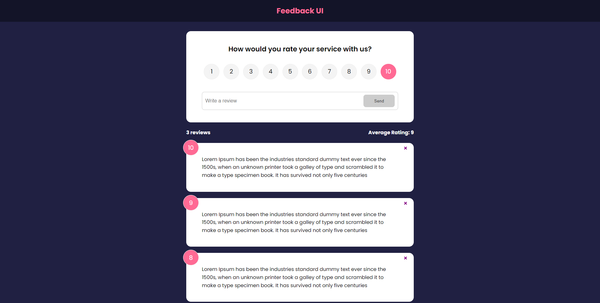

<div align="center">
  
  <h1>Anderson Toledo Martins Moreira</h1>
  <h4>
    Frontend Software Engineer <br />
    <a href="http://www.atmm.dev" target="_blank">Resume Online</a>
  </h4>
</div>
<br >
<!-- References for Create budgets :: https://shields.io/category/build -->
<div align="center">
  
  
  
  
  
</div>

<br >

## Description
This is a project to improve my skills with Javascript, React, CSS and Firebase. Building a House Marketplace Project.

## Screens Layout
<div align="center">
  
</div>

<br >

## Programming Languages and Frameworks.
```bash
# HTML5 / CSS3
# Javascript
# Git / Github
# React 18.2.0
# FireBase
# React Router DOM
```

<br >

## System Requirements
```bash
# Git
# Node
# Vite
```

<br >

## Getting Started With Local Development Configuration

```bash
# Download or clone the repository.
# Open the project inside your favorite IDE (I use VSCode).
# To install dependencies of this project, type in the terminal: npm install or npm i.
# To run this project, type in the terminal: npm run start.
# In your favorite Browser, open this URL:  http://localhost:5173/ to see the Interface.
# In your favorite Browser, open this URL:  http://localhost:5000/ to see the API.
```